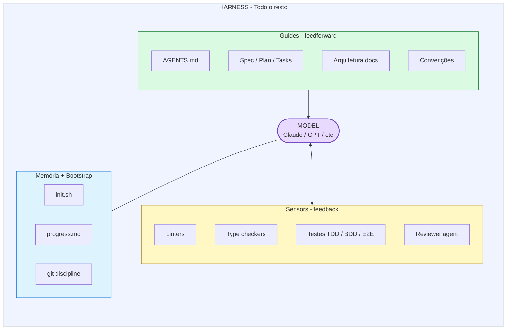
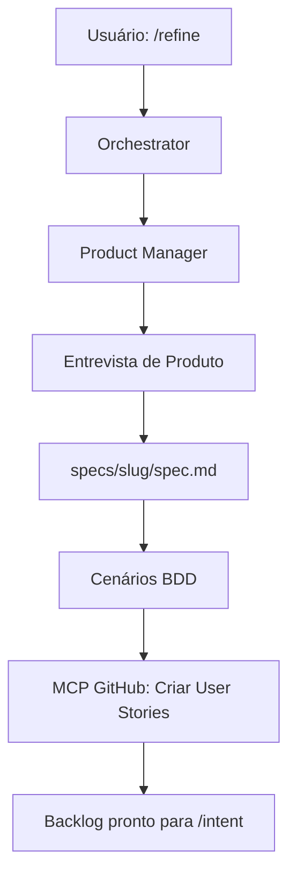
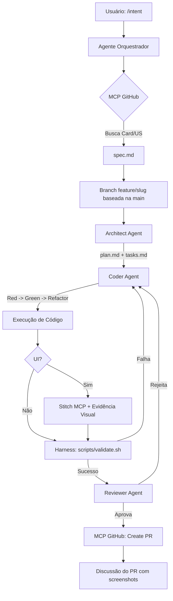

# Harness Engineering: Guia Conceitual

Este documento explica os componentes fundamentais do fluxo de Harness Engineering implementado neste projeto.

## 1. O que é Harness Engineering?
Harness Engineering (Engenharia de "Harness" ou "Cercado") é a prática de construir uma infraestrutura de suporte, validação e segurança em torno de agentes de IA. O objetivo é permitir que a IA opere com autonomia, mas dentro de limites estritos de qualidade e segurança.

## 2. Componentes do Framework

### Arquitetura Visual do Harness



### 🏗️ O Harness (O Cercado)
O conjunto de scripts e testes que validam o output da IA.
- **Local:** `scripts/` e `tests/harness/`
- **Função:** Impedir que código quebrado ou inseguro chegue ao commit final.

### 🤖 Agentes (Agents)
Entidades com papéis específicos.
- **Product Manager:** Refina features, cria specs SDD e User Stories.
- **Orquestrador:** Coordena os fluxos `/refine` e `/intent`.
- **Architect:** Desenha o plano técnico a partir da spec.
- **Coder:** Focado em implementação e refatoração.
- **Reviewer:** Focado em diff, drift, PR, segurança, testes e aderência ao Stitch.

### 🧠 Habilidades (Skills)
Padrões de raciocínio pré-definidos (Prompts reutilizáveis).
- Inspirados em bibliotecas como `skills.sh`.
- Exemplos: `TDD-Logic`, `Clean-Code`, `tlc-spec-driven`, `review-diff`, `stitch-loop`.

### 📐 SDD + TDD + BDD
Este harness adota o GitHub Spec Kit como backbone conceitual:

```text
Spec -> Plan -> Tasks -> Implement
```

- **SDD:** `specs/<slug>/spec.md` define o que construir.
- **BDD:** cenários `Dado / Quando / Então` descrevem comportamento observável.
- **TDD:** implementação segue Red -> Green -> Refactor.
- **TLC:** `.agents/skills/tlc-spec-driven/SKILL.md` ajuda com auto-sizing, memória e brownfield.

### 🔌 MCP (Model Context Protocol)
A ponte entre a IA e ferramentas externas.
- **GitHub MCP:** Para Issues, Projects, branches, PRs, comentários e evidências.
- **Stitch MCP:** Para protótipos, screenshots, geração/comparação de telas e contexto visual.
- **Memory MCP:** Para manter contexto entre sessões.

## 3. Estrutura de Pastas

```text
├── .agents/          # Definição de personas e permissões de ferramentas
├── .skills/          # Lógicas de raciocínio e padrões de código
├── .harness/         # Definição do workflow e estados da orquestração
├── .stitch/          # Contexto visual para integração com Stitch
├── .memory/          # Contexto persistente e índices do projeto
├── .specify/         # Constituição e templates inspirados no GitHub Spec Kit
├── specs/            # Artefatos spec/plan/tasks por feature
├── templates/        # Templates de specs e artefatos
├── docs/             # Documentação conceitual e técnica
├── scripts/          # Ferramentas que os agentes podem executar (Tools)
└── tests/harness/    # Infraestrutura de testes para validação autônoma
```

## 4. Fluxo de Refinamento (O Ciclo `/refine`)



1. **Trigger:** Usuário chama `/refine`.
2. **Product Manager:** Refina problema, persona, valor e escopo.
3. **Spec Driven Development:** Cria `specs/<slug>/spec.md`.
4. **Behavior Driven Development:** Escreve cenários `Dado / Quando / Então`.
5. **GitHub Project:** Cria cards de User Story via GitHub MCP.
6. **Stop:** Nenhum código é implementado nessa etapa.

## 5. Fluxo de Execução (O Ciclo `/intent`)



1. **Trigger:** Usuário chama `/intent`.
2. **MCP GitHub:** O orquestrador busca a User Story/card.
3. **Spec:** O agente lê `specs/<slug>/spec.md`.
4. **Branch:** Cria `feature/<slug>` a partir da `main`. Nunca usa `main` ou `master` diretamente.
5. **Planning:** O Architect cria `specs/<slug>/plan.md` e `specs/<slug>/tasks.md`.
6. **BDD Traceability:** Cada cenário `SCN-*` aponta para teste ou evidência.
7. **TDD Action:** O Coder implementa Red -> Green -> Refactor.
8. **Stitch:** Se houver UI, compara com o protótipo e gera evidência visual.
9. **Harness:** Scripts de validação (`scripts/validate.sh`) são rodados.
10. **Review:** O Reviewer aprova ou solicita correções.
11. **Finalization:** O PR é criado via MCP GitHub com links para card, spec, plan, tasks e evidências.
